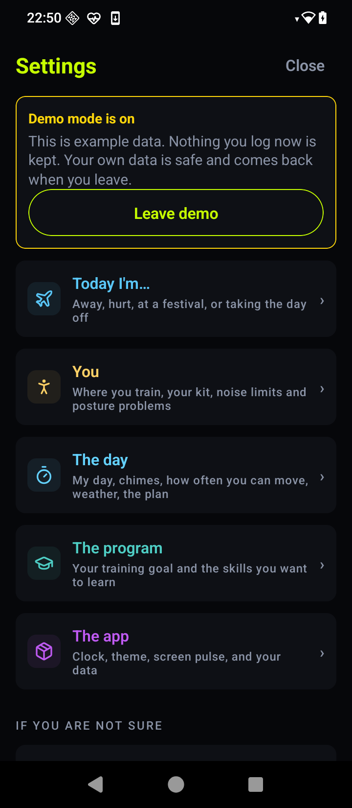

# The RaveLite guide

Everything worth knowing, in the order you will need it. If you have not
installed it yet, start with [the look around](tour.md) or
[download it](https://github.com/Jthora/RaveLite-App/releases/latest).

**Contents**

1. [The first ten minutes](#1-the-first-ten-minutes)
2. [Answering a chime](#2-answering-a-chime)
3. [When chimes stop — read this one](#3-when-chimes-stop--read-this-one)
4. [Daily Sets, and how the numbers move](#4-daily-sets-and-how-the-numbers-move)
5. [The five elements](#5-the-five-elements)
6. [Your levels](#6-your-levels)
7. [Telling it about your day](#7-telling-it-about-your-day)
8. [Your data](#8-your-data)
9. [Settings, room by room](#9-settings-room-by-room)
10. [When something is wrong](#10-when-something-is-wrong)

---

## 1. The first ten minutes

Setup is **six questions and you can skip every one of them.** Skipping
gives you the base program at a beginner's level, which is a perfectly
good place to start.

The questions, and why each is asked:

| Question | What it changes |
|---|---|
| What are you training for? | Sets your starting packs, day shape and sets in one go |
| Where do you train, and what do you have? | The program only ever asks for things you marked here |
| When does your day run? | Chimes only sound inside those hours |
| What is your day like? | How many times a day it asks you to move |
| Where are you starting? | Your first numbers, before any test |
| Anything you want to learn? | Adds skills on top of the base program |

**The kit question is the one worth answering properly.** A mat, a
doorway, something to hang from — each one unlocks drills, and the app
will never ask for a pull-up if you did not tell it you have a bar.

Everything is changeable later in Settings, so a wrong answer costs you
about a week, not the experiment.

At the end you get a page saying what your day now looks like: how many
chimes, how many are exercise, how many drills fit your kit. Then the
first chime fires — a real one, a chin tuck, which needs no kit and no
floor.

---

## 2. Answering a chime

A chime is **one thing to do, right now.**

From the notification, without opening the app:

- **Done** — logs it at the time it chimed
- **+5** — pushes it five minutes later
- **Skip** — drops this one

That is the whole loop. Everything else in the app is bookkeeping around
it.

**Missed a few?** Today has a **Catch up** row. Tick what you actually
did and each gets logged at the time it chimed, not now.

**Did something the app never asked for?** **+ Log** on Today, or **+
Log** on any element page.

**Tapped Done by mistake?** Tap the row in the day list and remove it.

---

## 3. When chimes stop — read this one

This is the single thing most likely to go wrong, and it is not the
app's fault, and only you can fix it.

**Every large phone maker adds its own gates on top of Android**, and
**no app can read any of them.** There is no API. There never has been.

| Maker | What to turn on |
|---|---|
| Xiaomi, Redmi, POCO | Autostart, and Battery saver → No restrictions |
| Samsung | Never sleeping apps, and turn off "Put unused apps to sleep" |
| Oppo, OnePlus, realme | App battery management → allow auto-launch and background |
| vivo, iQOO | Autostart, and Background power consumption → allow |
| Huawei, Honor | App launch → Manage manually → all three switches on |
| Tecno, Infinix, itel | Phone Master → Auto-start, and Battery Lab off |
| Motorola, Sony | Battery → Unrestricted |
| Pixel, Nothing | Usually nothing — Battery → Unrestricted if it still stops |

**Settings › The day › Stay alive** lists what your phone needs, names
your maker's own screens, and says plainly which ones it could not
check.

Two more that catch everybody, whatever the make:

- **Clearing RaveLite out of recent apps** takes the scheduled chimes
  with it until you open the app again.
- **Pressing Stop** on it in the notification shade does the same.

The permanent notification in your shade is not spam — it is what keeps
the app alive. Dismissing it is the same as closing the app.

---

## 4. Daily Sets, and how the numbers move

A **track** is one movement you train. Push, pull, row, squat, hang,
breath, stillness, and a few more. Each has **steps** from easy to hard —
for push that is incline, then standard, then diamond, then decline.

**How your numbers get set.** Test your max once: one clean set to your
limit. Daily sets then size at roughly half of it, spread across the day,
because ten sets of ten beats one set of a hundred you never do.

**How they move.**

- Finish about 85% of a week's sets → one more set a day
- Miss a stretch → it comes down, and comes back gradually
- Every fourth week is lighter on purpose, and is when to test again
- Hit the top of a step → move up to the harder exercise

**You can turn any track off.** If sit-ups are not your thing, they are
not your thing.

**Nothing here punishes you for missing.** There is no chain to break.
The program adjusts to what you did and carries on.

---

## 5. The five elements

Every drill belongs to one of five groups, and each earns points for it.

| | Element | What it trains |
|---|---|---|
| △ | **Fire** | Capacity and output — push, pull, carry, run |
| ⌬ | **Air** | Breath and the open chest |
| ▽ | **Earth** | The core and the rooted pelvis |
| ▼ | **Water** | Flow, fascia and hydration — no pool required |
| ♡ | **Heart** | Conducts: the schedule, the chimes, the day |

Aim for the same number of points in each, every day. All five in one day
is a **Harmony day** — the app's only real streak, and the reason it asks
for breath and stillness as often as push-ups.

Element pages (tap a tile on Today) give you that element's pick for
right now, its last fourteen days, and its log.

---

## 6. Your levels

Fifteen levels, five elements across three kinds of training — starting a
move, holding, changing. They run 0 to 100 and rise from what you
actually log, not what you planned.

Doing the work takes a level to 85. Past that, only a passed test counts.

It is a record, not a score to chase. The sheet stays closed until you
have a week of training in it, because a grid of fifteen zeroes is not a
character sheet, it is a reproach.

**Goals** (inside Daily Sets) holds the fitness tests — push-ups, runs,
planks — with target marks you can change.

---

## 7. Telling it about your day

**Settings › Today I'm…** — away, hurt, at a festival, or taking the day
off. Each mode changes what the app asks for, and each ends by itself.

**Hurt** is the useful one: name the part and the app stops asking for
anything that loads it until you say otherwise.

**My day** is the window chimes can sound in. Outside it the screen dims
and nothing fires. It can end after midnight.

**Pause** stops chimes for a stretch when you need quiet, and says when
they come back.

---

## 8. Your data

**It is on your phone and nowhere else.** No account, no server, nothing
to recover from.

**Settings › The app › Your data:**

- **Export** — writes everything to a file you choose. Do this now and
  then; it is the only copy that survives losing the phone.
- **Restore** — reads a file back. It *replaces* what is there; it does
  not merge.
- **Report a problem** — sends a file of your data to whoever is helping.
- **Start over** — erases everything. Two taps, and it names what it
  takes.

Restoring works across phones and across versions, so an export from
today opens on a new phone next year.

---

## 9. Settings, room by room

**Today I'm…** — away, hurt, festival, day off.

**You** — where you train, your kit, noise limits, posture problems.

**The day** — My day, chimes, how often you can move, weather, the plan,
and **Stay alive**.

**The program** — your training goal and the skills you want to learn.

**The app** — clock (24-hour or AM/PM), theme, screen pulse, and your
data.

**If you are not sure** — walk the setup questions again with your
answers filled in, or start from scratch.

*The yellow banner in this screenshot is demo mode, which is how these
pictures get taken without photographing anybody's real training. You
will not see it.*

 

---

## 10. When something is wrong

**Chimes are silent** → [section 3](#3-when-chimes-stop--read-this-one),
then Stay alive. Check the alarm volume; chimes play on the alarm stream.

**Chimes stopped after a day or two** → your phone is putting the app to
sleep. That is section 3 as well.

**The app asks for things you cannot do** → Settings › You. Fix your kit
and your limits; the program only asks for what you marked.

**Sets feel far too hard or too easy** → take a max test on that track.
Everything is sized from it.

**Something looks broken** → Settings › The app › **App status** →
**Copy**, and paste that into
[an issue](https://github.com/Jthora/RaveLite-App/issues). It names the
build and the phone and nothing about you, which is most of the answer.

---

### ⬇ [Download RaveLite](https://github.com/Jthora/RaveLite-App/releases/latest)

Free · no account · Android 5.0+

