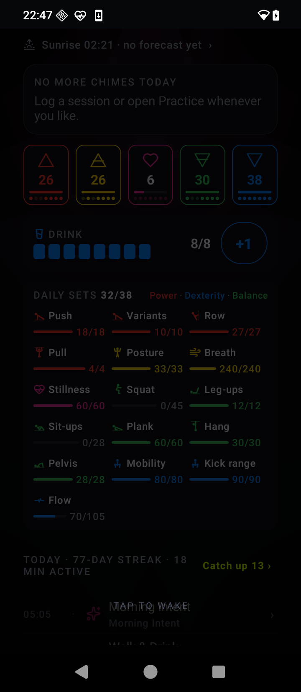
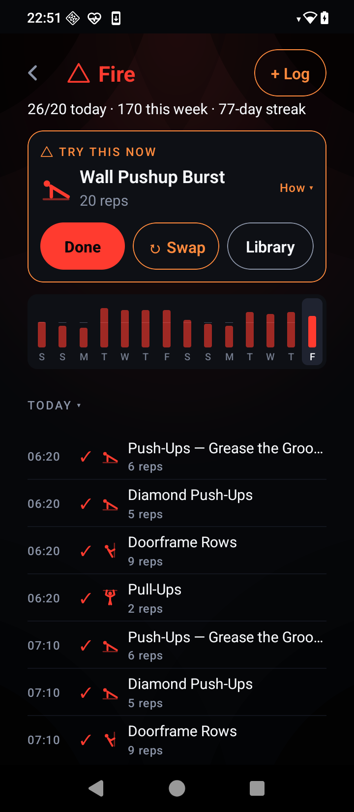
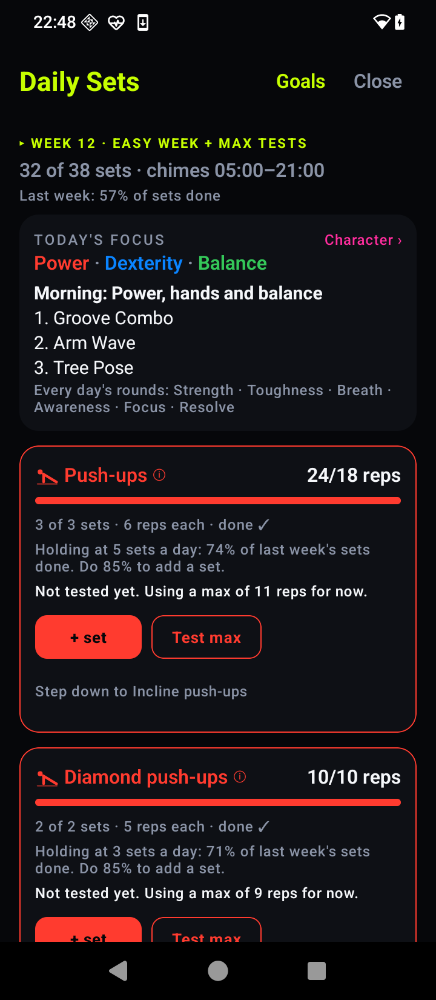
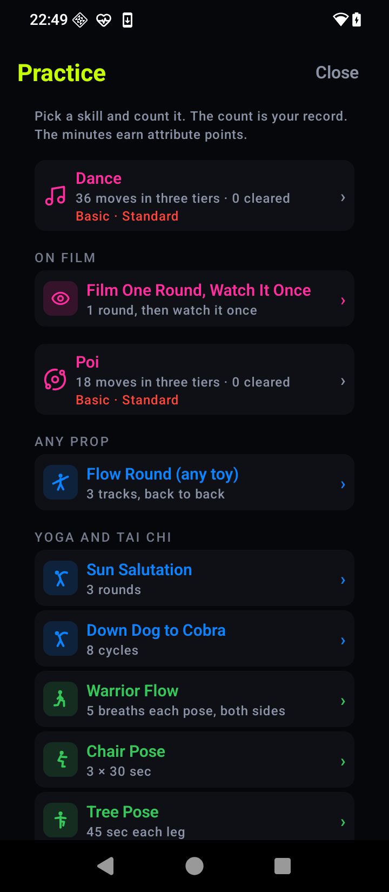
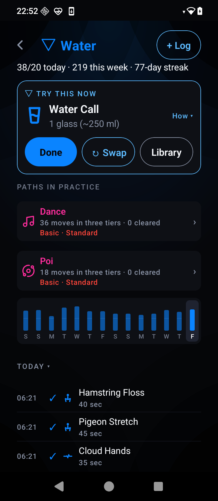

# A look at RaveLite

*Five minutes, mostly pictures. If you would rather just try it,
[download it](https://github.com/Jthora/RaveLite-App/releases/latest) —
it is free and there is no account.*

Every screenshot here is example data, not anybody's real training.

---

## 🔔 It chimes. You answer. That is the whole app.

There is no session to start and no workout to get through. A notification
arrives, asks for one small thing, and you do it where you are standing.

**Done** logs it. **+5** pushes it back five minutes. **Skip** drops it.
Three seconds, from the notification, without opening the app.

By evening you have trained, and you never went anywhere to train.

The five tiles are the five kinds of training, and the dots under each
one are the last seven days. The bar below them is water.

At the bottom: the day so far — what chimed, what you answered, what you
skipped, with the times.

 

---

## △ Five kinds of training, one page each

Tap a tile and you get that element's own page.

**Try this now** is the app's pick for right this minute, chosen from
what your kit and your room allow. **Done** logs it. **Swap** offers the
next best thing. **Library** opens everything the element has.

The bars are the last fourteen days, today on the right, so a gap is
obvious without reading a number.

**Fire** is capacity and output — push, pull, carry.
**Air** is breath and the open chest.
**Earth** is the core and the rooted pelvis.
**Water** is flow, fascia and hydration — no pool required.
**Heart** conducts: the schedule, the chimes, the day itself.

 

---

## ▦ Daily Sets: the long, boring, effective part

Ten push-ups, sixteen times a day, is a hundred and sixty push-ups you
never set aside an hour for. That is the idea, and this is where it is
tracked.

Each **track** is one movement you train — push, pull, squat, hang,
breath, stillness. Every track has steps from easy to hard, and the app
holds you on the step you are actually on.

Test your max once and the daily sets size themselves at roughly half of
it. Finish your weeks and they go up. Miss a stretch and they come back
down, quietly, without a lecture.

**No streak guilt.** Missing is expected; the program adjusts rather than
scolding.

 

---

## ◇ Skills, not just reps

Push-ups are not the point. Being able to dance all night, spin a staff,
hold a handstand, kick head-high — that is the point.

**Practice** is the curriculum: dance moves, poi and staff, yoga and tai
chi, each in tiers you clear at your own pace. Count what you did and it
becomes your record.

There is a drill in here that asks you to film one round and watch it
once, which is the fastest way to find out what you actually look like.

 

---

## 💧 It notices the day you are actually having

Water asks more of you on a hot day, and says why. Sunrise and sunset
come from where you are, if you let them. A festival, an injury, a day
off — each is a mode that changes what the app asks for instead of
pretending nothing happened.

Tell it you are hurt and it stops asking for anything that loads the part
that hurts, until you say otherwise.

 

---

## 🔒 Nothing leaves your phone

No account. No server. No analytics. No ads. No sign-up.

Your training is on your phone and nowhere else — which is the point, and
also the risk, so **Settings › The app › Your data › Export** writes the
whole thing to a file you choose. There is nothing to recover it from if
you skip that.

The app asks for the network exactly once, for an optional weather
lookup, and only if you turn it on.

---

## What it is not

Not a fitness app that wants a session. Not a habit tracker with a chain
to break. Not a social network. No leaderboard, no friends, no feed, no
beat-detection light show, whatever older versions of this README
promised.

It is one person's app, opened up. **Beta, no support promised** — but
bug reports are read.

---

### ⬇ [Download RaveLite](https://github.com/Jthora/RaveLite-App/releases/latest)

Free · no account · Android 5.0+

**Next:** [The full guide](guide.md) — the first hour, why chimes stop on
some phones, and how the program decides what to ask for.

